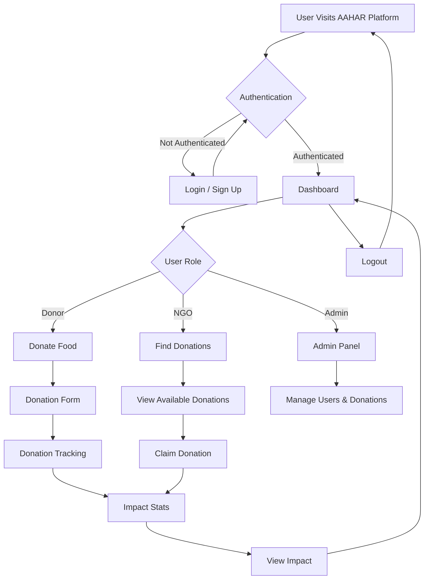

# AAHAR: Smart Food Waste & Donation Manager

## 🥗 Project Idea Summary

**Sustainable Development with financial aid**
A digital platform that uses smart waste tracking and donation logging to reduce food waste and improve sustainability in hospitality and food services, aligned with SDG 12.3 (Halve food waste by 2030).

---

## 💡 Why This Platform?
Based on real-world case studies:
- **1.8 tons** of food waste reduced annually per hotel using tracking
- **~€8,000/year** saved per kitchen
- **~6.8 tons** of CO₂ reduced per site
- **Benefit-Cost Ratio (BCR):** 11:1
- **Environmental footprint reduction:** 841 PEF mPt

---

## 🔁 Workflow: Buffet/Kitchen to Donation or Disposal
1. **Data Logging (Kitchen):**
   - Staff logs leftover data in mobile/web app
   - Auto-weight sensors or manual entry
   - AI categorizes items (optional)
2. **Hash Generation (Backend):**
   - Use `crypto-js` to create a SHA-256 hash for each donation record
   - Example:
     ```js
     const hash = SHA256(`${item}-${quantity}-${timestamp}`).toString();
     ```
3. **QR Code Generation:**
   - Encode hash into QR (shown to driver/NGO)
   - Re-scan on delivery to verify authenticity
4. **Real-Time Dashboard:**
   - Tracks weight trends, CO₂ reduction, nutritional value saved
   - Impact visualized by donation type, source, and recipient
5. **Donation Confirmation:**
   - NGO/diner scans QR code at receipt point
   - Confirms delivery; status marked as "delivered"
6. **Analytics & Reporting:**
   - Auto-generate monthly/annual reports (CO₂, savings, kg saved)
   - Ready for ESG compliance and CSR marketing

---

## ⚙️ Recommended MERN Tech Stack
- **Frontend (React.js):**
  - React.js + Vite – Fast frontend app
  - TailwindCSS – Fast styling
  - axios – API calls
  - qrcode.react – QR generation
  - react-qr-reader – QR scanning at pickup/drop
  - Recharts – Sustainability and impact charts
  - React-PWA – Offline support for low-connectivity kitchens
- **Backend (Node.js + Express.js):**
  - Node.js + Express.js – REST APIs
  - crypto-js – Generate SHA-256 hash for traceability
  - socket.io – Real-time dashboard updates
  - jsonwebtoken – User authentication (Donor, NGO, Admin)
- **Database (MongoDB):**
  - MongoDB Atlas – NoSQL cloud DB
  - Mongoose – ODM with schema validation
  - Tracks donation data, users, NGOs, QR scan logs
- **Optional: AI Module**
  - TensorFlow.js – Food item classification (e.g., fruits, bakery)
  - ML5.js – Lightweight classification for mobile browser
- **Third-Party Integration:**
  - SMS Gateway (e.g. Twilio) for offline areas
  - Mapbox or Leaflet for delivery zone visualization
  - Emailer (Nodemailer) – Send donation receipts to NGOs/donors

---

## 🧠 Key Features vs Others

| Feature                  | Manual/Excel | Existing Donation Apps | AAHAR (Your Platform) |
|-------------------------|:------------:|:---------------------:|:---------------------:|
| QR + Hash verification  |      ❌      |          ❌           |          ✅           |
| CO₂ / kcal / cost saved |      ❌      |          ❌           |          ✅           |
| Realtime Dashboards     |      ❌      |        Partial         |          ✅           |
| Auto Reporting          |      ❌      |          ❌           |          ✅           |
| PWA & Offline Support   |      ❌      |          ❌           |          ✅           |
| BCR (Benefit-to-Cost)   |   Unknown    |       Unknown          |      11:1 (proven)    |

---

## Repository Links
- **Backend Code:** [https://github.com/sss2025initiative/Aahaar](https://github.com/sss2025initiative/Aahaar)
- **Frontend Code:** [https://github.com/Santoshpatel112/AAHAR2.0](https://github.com/Santoshpatel112/AAHAR2.0)

## Table of Contents
- [Overview](#overview)
- [Features](#features)
- [Technology Stack](#technology-stack)
- [Project Structure](#project-structure)
- [Setup Instructions](#setup-instructions)
- [Workflow Diagram](#workflow-diagram)
- [Management & Control](#management--control)
- [Contribution](#contribution)
- [License](#license)

---

## Overview
AAHAR connects food donors (restaurants, hotels, etc.) with NGOs to reduce food waste and deliver surplus food to those in need. The platform provides:
- Real-time donation tracking
- Role-based dashboards (Donor, NGO, Admin)
- Impact analytics
- Secure authentication
- Transparent verification

## Features
- **Role-Based Access:** Donor, NGO, and Admin dashboards
- **Donation Management:** Multi-step donation forms, tracking, and verification
- **Impact Analytics:** Real-time stats and reporting
- **Admin Controls:** User and donation management
- **Mobile-Friendly UI:** Responsive design for all devices
- **Secure Authentication:** Context-based auth management

## Technology Stack
- **Frontend:** React, TypeScript, Tailwind CSS ([Frontend Repo](https://github.com/Santoshpatel112/AAHAR2.0))
- **Backend:** Node.js, Express.js, MongoDB ([Backend Repo](https://github.com/sss2025initiative/Aahaar))
- **Routing:** React Router
- **State Management:** React Context API
- **UI Components:** Custom and reusable components
- **Build Tool:** Vite

## Project Structure
```
AAHAR/
  ├── public/                # Static assets
  ├── src/                   # Frontend source code ([Frontend Repo](https://github.com/Santoshpatel112/AAHAR2.0))
  │   ├── components/        # UI components (NavBar, Footer, Dashboards, etc.)
  │   ├── contexts/          # Auth context
  │   ├── hooks/             # Custom hooks
  │   ├── lib/               # Utility functions
  │   ├── pages/             # Page components (Login, Dashboard, Donate, etc.)
  │   ├── types/             # TypeScript types
  │   └── main.tsx           # App entry point
  ├── backend/               # Backend source code ([Backend Repo](https://github.com/sss2025initiative/Aahaar))
  ├── index.html             # Main HTML file
  ├── package.json           # Project metadata
  └── README.md              # Project documentation
```

## Setup Instructions
1. **Clone the repository:**
   ```bash
   git clone <repo-url>
   cd AAHAR
   ```
2. **Install dependencies:**
   ```bash
   npm install
   # or
   bun install
   ```
3. **Run the development server:**
   ```bash
   npm run dev
   # or
   bun run dev
   ```
4. **Open in browser:**
   Visit [http://localhost:5173](http://localhost:5173) (or the port shown in your terminal).

---

## Workflow Diagram



---

## Management & Control

### User Roles
- **Donor:** Can create and track food donations, view impact stats.
- **NGO:** Can find, claim, and verify donations, and view impact.
- **Admin:** Full control over users, donations, and platform analytics.

### Main Controls
- **Authentication:** Secure login/signup, role-based access
- **Navigation:** Responsive NavBar with role-specific links
- **Donation Flow:** Multi-step forms, real-time tracking, and verification
- **Impact Analytics:** Dashboard stats, recent donations, and testimonials
- **Admin Panel:** User and donation management, platform settings

---

## Contribution
1. Fork the repository
2. Create a new branch (`git checkout -b feature/your-feature`)
3. Commit your changes (`git commit -am 'Add new feature'`)
4. Push to the branch (`git push origin feature/your-feature`)
5. Open a Pull Request

---

## License
This project is licensed under the MIT License.

---

*Would you like this turned into a 1-pager pitch PDF, README template, or project presentation deck? I can generate that for you!*


