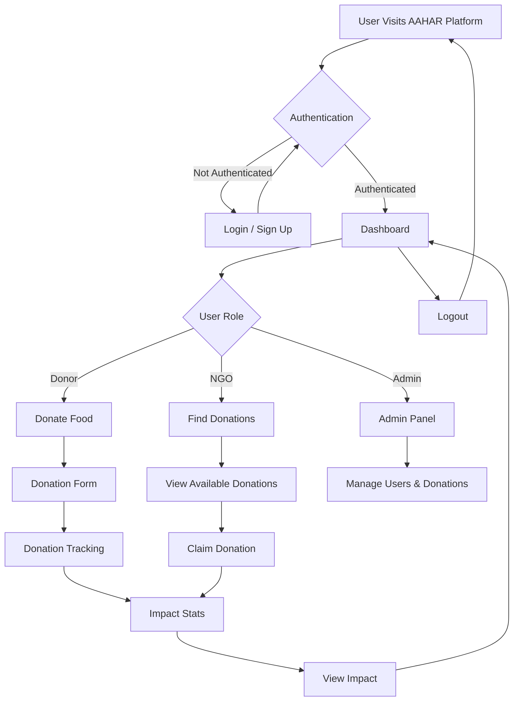

# AAHAR

AAHAR is a comprehensive food donation and waste reduction platform designed for restaurants, hotels, NGOs, and administrators. It leverages smart technology to track, verify, and manage food donations, ensuring transparency, efficiency, and measurable impact.

## Table of Contents
- [Overview](#overview)
- [Features](#features)
- [Technology Stack](#technology-stack)
- [Project Structure](#project-structure)
- [Setup Instructions](#setup-instructions)
- [Workflow Diagram](#workflow-diagram)
- [Management & Control](#management--control)
- [Contribution](#contribution)
- [License](#license)

---

## Overview
AAHAR connects food donors (restaurants, hotels, etc.) with NGOs to reduce food waste and deliver surplus food to those in need. The platform provides:
- Real-time donation tracking
- Role-based dashboards (Donor, NGO, Admin)
- Impact analytics
- Secure authentication
- Transparent verification

## Features
- **Role-Based Access:** Donor, NGO, and Admin dashboards
- **Donation Management:** Multi-step donation forms, tracking, and verification
- **Impact Analytics:** Real-time stats and reporting
- **Admin Controls:** User and donation management
- **Mobile-Friendly UI:** Responsive design for all devices
- **Secure Authentication:** Context-based auth management

## Technology Stack
- **Frontend:** React, TypeScript, Tailwind CSS
- **Routing:** React Router
- **State Management:** React Context API
- **UI Components:** Custom and reusable components
- **Build Tool:** Vite

## Project Structure
```
AAHAR/
  ├── public/                # Static assets
  ├── src/
  │   ├── components/        # UI components (NavBar, Footer, Dashboards, etc.)
  │   ├── contexts/          # Auth context
  │   ├── hooks/             # Custom hooks
  │   ├── lib/               # Utility functions
  │   ├── pages/             # Page components (Login, Dashboard, Donate, etc.)
  │   ├── types/             # TypeScript types
  │   └── main.tsx           # App entry point
  ├── index.html             # Main HTML file
  ├── package.json           # Project metadata
  └── README.md              # Project documentation
```

## Setup Instructions
1. **Clone the repository:**
   ```bash
   git clone <repo-url>
   cd AAHAR
   ```
2. **Install dependencies:**
   ```bash
   npm install
   # or
   bun install
   ```
3. **Run the development server:**
   ```bash
   npm run dev
   # or
   bun run dev
   ```
4. **Open in browser:**
   Visit [http://localhost:5173](http://localhost:5173) (or the port shown in your terminal).

---

## Workflow Diagram



---

## Management & Control

### User Roles
- **Donor:** Can create and track food donations, view impact stats.
- **NGO:** Can find, claim, and verify donations, and view impact.
- **Admin:** Full control over users, donations, and platform analytics.

### Main Controls
- **Authentication:** Secure login/signup, role-based access
- **Navigation:** Responsive NavBar with role-specific links
- **Donation Flow:** Multi-step forms, real-time tracking, and verification
- **Impact Analytics:** Dashboard stats, recent donations, and testimonials
- **Admin Panel:** User and donation management, platform settings

---


